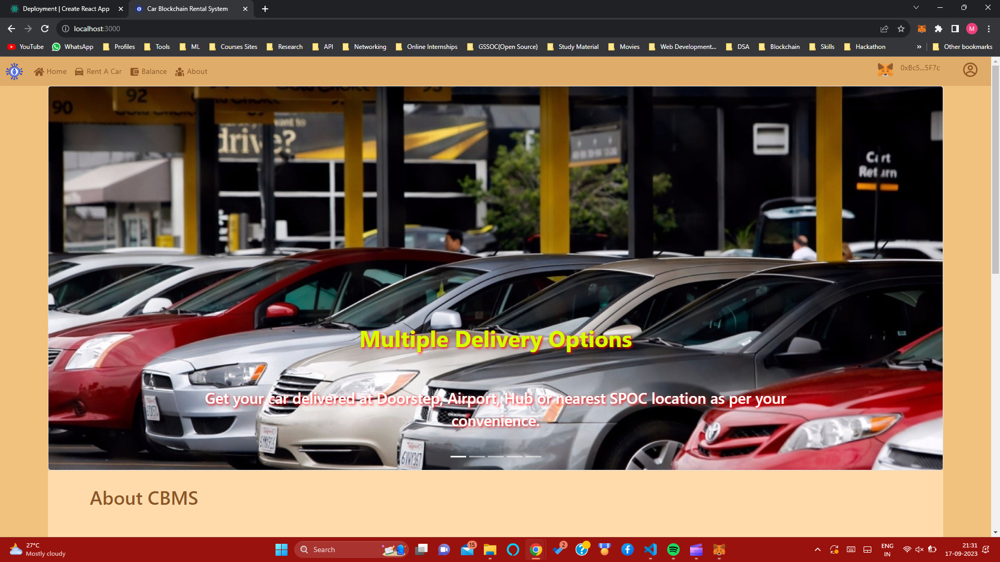
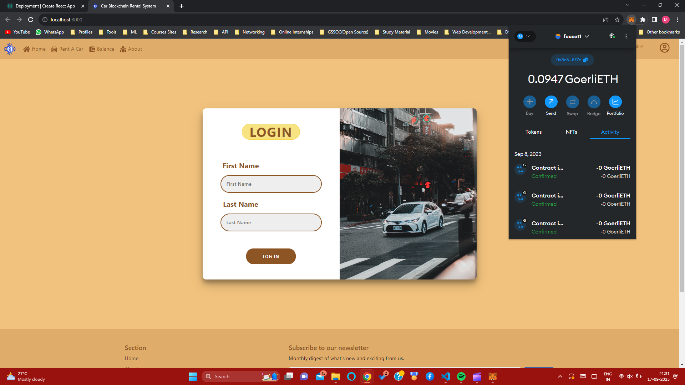
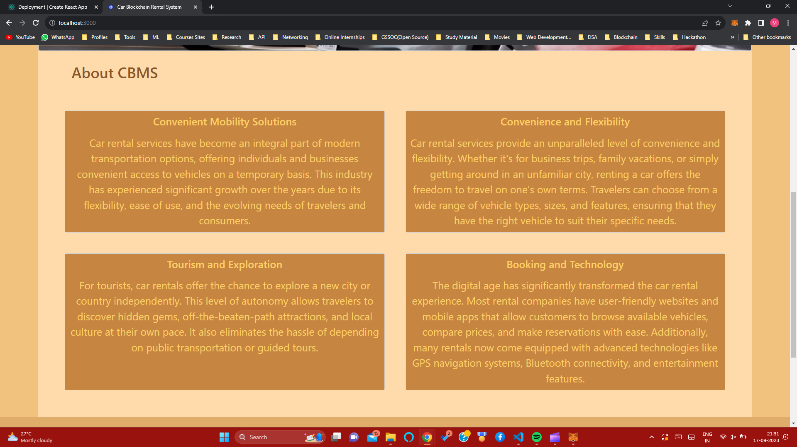
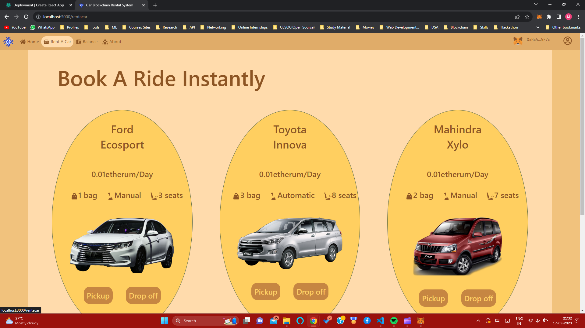
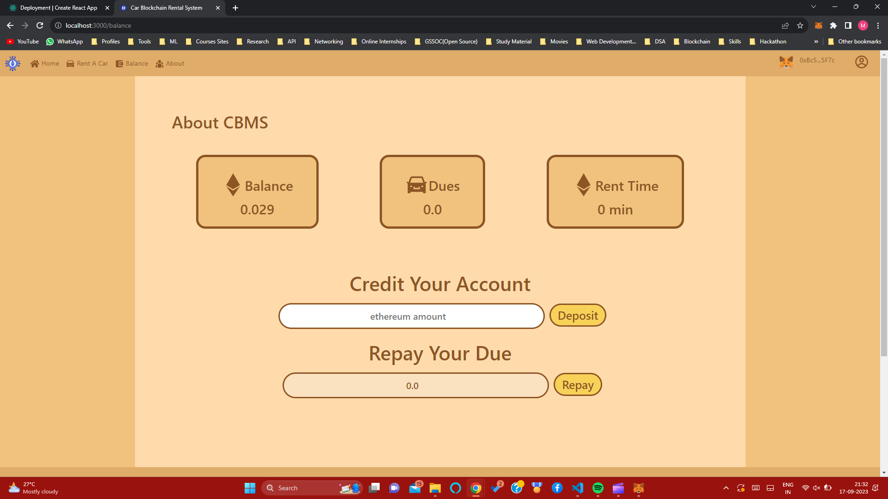
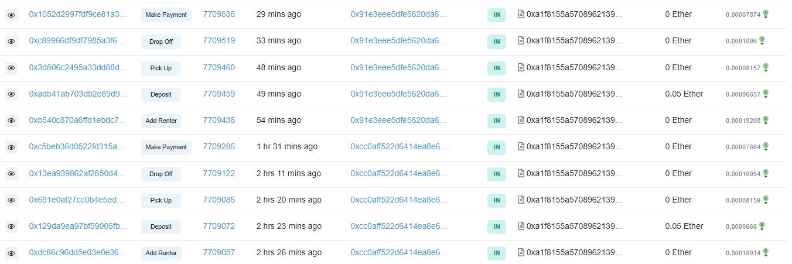

# Car Rental Blockchain System

> Blockchain based web application based on smart contracts in solidity. Contract deployed on Goerli network at this moment. 
## Table of Contents

- [General Info](#general-information)
- [Technologies Used](#technologies-used)
- [Features](#features)
- [Screenshots](#screenshots)
- [Setup](#setup)
- [Usage](#usage)
- [Project Status](#project-status)
- [Room for Improvement](#room-for-improvement)
- [Contact](#contact)

## General Information

- Use power of smart contracts to create decentralized car rental company. You can rent a car after depositing small amount of eth on contract address. After pick up a car timer will start count how long you use car before drop off. You can't rent another car before you drop off this one. You can't withdraw money before you drop off car. After drop off application will calculate due. From now you can pay due whenever you want but before it , you can't withdraw rest of your funds or even pick up another car.

## Technologies Used

- Solidity: 0.8.17
- Hardhat: 2.11.2
- Mocha: 10.0.0
- React: 18.2.0
- Redux: 4.2.0
- Sass: 1.54.9
- JavaScript
- React-dom: 18.2.0
- React-router-dom: 6.4.0
- React-scripts: 5.0.1
- Reduxjs/toolkit: 1.8.5
- React-redux: 8.0.2,
- Animate.css: 4.1.1
- Etherscan: 3.1.0
- Solidity-coverage: 0.8.2

## Features

<!-- List the ready features here: -->

- create a contract and assign to an immutable owner
- create struct with user data and asign it to erc-20 address
- deposit eth on contract if user is in Renters array
- pick up a car only if deposit is > 0 and user don't have active due or active car rented
- assign picked up car to user
- start count time from block acceptation until drop off a car. Then calcualte a due to pay for rental time
- withdraw is possible only when user have no due or active car rented
- payment to contract for due from deposited amount - not directly from wallet
- geting user informations with view functions (out of charge)
## Screenshots

## Video

## Setup

npm init
npm inastall
download and use metamask extension for browser
prepare .env file based on .env.example.
npx hardhat run scripts/deploy.js --network goerli

## Project Status

Project is: in progress

<!-- / complete / no longer being worked on. If you are no longer working on it, provide reasons why. -->

## Room for Improvement

<!-- Include areas you believe need improvement / could be improved. Also add TODOs for future development. -->

- write more tests for contract
- add more information for user while exectuting contrract
- using new blockchain platform like Polygon

To do:

- withdraw all available founds functionality
- visual improvement for good user experiance while waiting for contract execution
